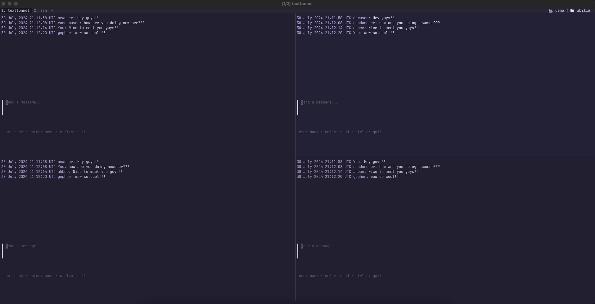
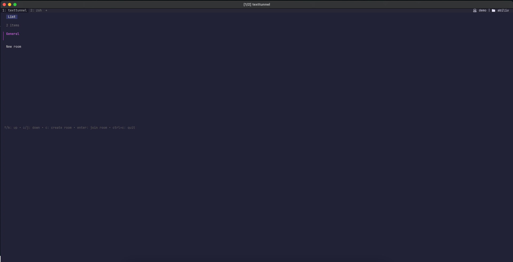

# TextTunnel
A real-time messaging application based entirely inside your terminal.

  
  

## Motivation
As a developer primarily experienced in backend and web development, I've often found myself within the comfort zone of building graphical user interfaces and traditional server-side applications. Terminal Chat is a project aimed at pushing my boundaries by delving into the world of terminal user interfaces (TUIs). This project not only challenges me to implement real-time communication using WebSockets and Go's concurrency features but also helps me grow by exploring the intricacies of building effective and user-friendly TUIs.

## Goals
The primary goal of Terminal Chat is to create a seamless and responsive real-time chat application that runs entirely in the terminal. Key objectives include:

* Real-Time Messaging: Enable instant messaging between users with minimal latency.
* Concurrency: Utilize Go's goroutines to handle multiple users and messages efficiently.
* WebSocket Integration: Implement WebSocket protocol for persistent, low-latency communication.
* User-Friendly Interface: Design a simple, intuitive command-line interface that is easy to navigate and use.
* Scalability: Build a robust server capable of handling a large number of concurrent connections.
* Extensibility: Lay the foundation for future enhancements such as private messaging, data encryption, and possibly even AI integration.

## Getting Started

### Prerequisites
* Go 1.22+ installed
  * If you do not yet have a working Go environment of at least v1.22, you can install it [here](https://go.dev/doc/install)

### Installation
`go install github.com/Abi-Liu/TextTunnel/cmd/chat_client/texttunnel@latest`

### Running
#### Production
After installing the application, navigate to your favorite terminal and run `texttunnel`. The TUI application will launch and you will automatically connect to the hosted server. Simply create an account and you can immediately begin chatting!

#### Locally
* Clone the repo `git clone https://github.com/Abi-Liu/TextTunnel.git`
* Replace the env variables inside of `.env.example` with your own values **NOTE:** This project expects you to use Postgres as the database. If you do not have it installed you can download [here](https://www.postgresql.org/download/)
    * At the end of your Postgres connection string, make sure to include this snippet: `?sslmode=disable`
* Migrate your database by running `./scripts/migrateup.sh`
* You can now run `make run-both`. Alternatively, you can also run `make run-server` and `make run-client` in separate terminal windows to achieve the same effect.
* And there you go. You have your own local version up and running!

## Contributing
I would love your help! Contribute by forking the repo and opening pull requests. All pull requests should be submitted to the `main` branch.
Feel free to submit an issue if you find a bug or just to request a feature you think should be included!
